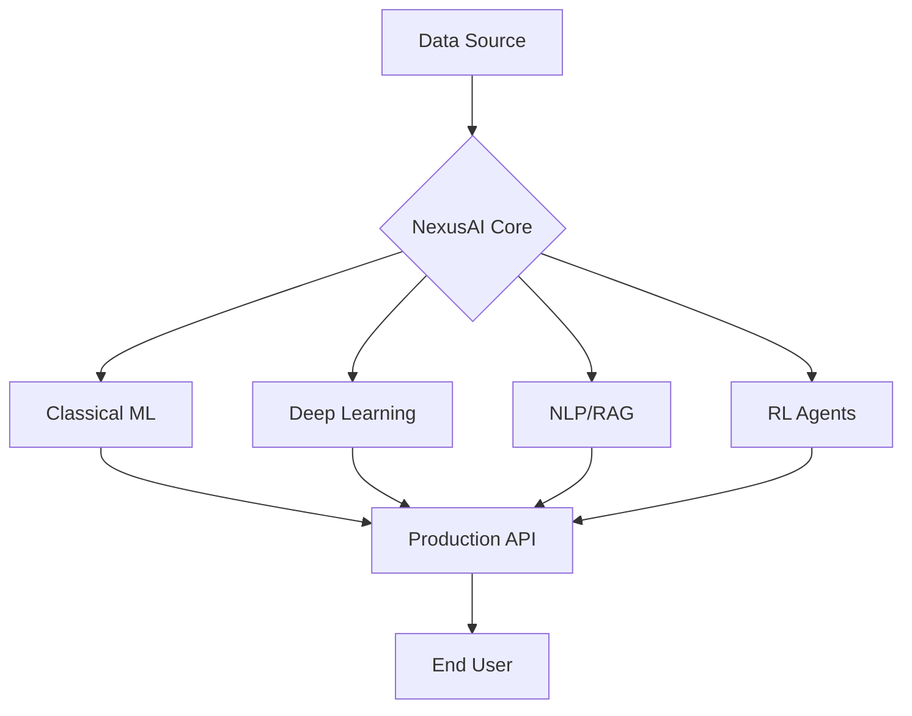

# 🌌 NexusAI-Suite: Advanced AI & ML Ecosystem

[](https://opensource.org/licenses/MIT)
[](https://www.python.org/downloads/)
[](https://pytorch.org/)
[](https://scikit-learn.org/)
[](https://fastapi.tiangolo.com/)

**NexusAI-Suite** is a professional-grade, comprehensive repository designed for building, training, and deploying state-of-the-art Artificial Intelligence and Machine Learning models. From classical statistical models to modern Large Language Models (LLMs) and Reinforcement Learning agents, this suite provides modular, production-ready implementations.

---

## 🚀 Key Modules

### 1. 📊 Classical Machine Learning (`src/classical/`)
Production-ready pipelines for tabular data using `scikit-learn`.
- **Model Factory:** Modular access to XGBoost, Random Forest, and SVMs.
- **Auto-Pipeline:** Automated feature scaling, encoding, and hyperparameter tuning.

### 2. 👁️ Computer Vision (`src/vision/`)
High-performance Deep Learning models powered by `PyTorch`.
- **Architectures:** Implementations of ResNet-50, Vision Transformers (ViT), and MobileNetV3.
- **Training Suite:** Advanced training loops with mixed-precision, early stopping, and TensorBoard logging.

### 3. 🧠 NLP & RAG Engine (`src/nlp/`)
Advanced semantic search and generation using `Hugging Face` and `ChromaDB`.
- **Hybrid RAG:** 2-stage retrieval with Dense Embeddings and Cross-Encoder re-ranking.
- **LLM Connectors:** Seamless integration with OpenAI, Llama 3 (via Ollama), and Mistral.

### 4. 🎮 Reinforcement Learning (`src/rl/`)
Agents capable of solving complex control tasks.
- **DQN/PPO Agents:** Custom implementations of Deep Q-Networks and Proximal Policy Optimization.
- **Experience Replay:** Optimized buffer for stable training in Gymnasium environments.

### 5. 🚢 MLOps & Deployment (`src/deployment/`)
Bridging the gap between research and production.
- **REST API:** FastAPI wrappers for all models with Pydantic schema validation.
- **Dockerized:** Ready-to-use Dockerfiles for scalable deployment.

---

## 🏗️ Architecture Overview



---

## 🛠️ Installation & Setup

1. **Clone the repository:**
   ```bash
   git clone https://github.com/nft94/NexusAI-Suite.git
   cd NexusAI-Suite
   ```

2. **Setup Virtual Environment:**
   ```bash
   python -m venv venv
   source venv/bin/activate  # Linux/Mac
   .\venv\Scripts\activate   # Windows
   ```

3. **Install Dependencies:**
   ```bash
   pip install -r requirements.txt
   ```

---

## 📖 Usage Examples

### Training a Classical Classifier
```python
from src.classical.factory import ModelFactory
from src.classical.pipeline import MLPipeline

# Load data
data = load_my_dataset()

# Build and train
pipeline = MLPipeline(model_type="random_forest")
pipeline.fit(data.X, data.y)

# Save for deployment
pipeline.save("models/rf_v1.joblib")
```

### Running the RAG Engine
```python
from src.nlp.rag import RAGEngine

rag = RAGEngine(vector_db="chroma")
rag.ingest("./docs")

response = rag.query("How does the self-attention mechanism work?")
print(response.answer)
```

---

## 🧪 Testing & Quality
We maintain high standards through rigorous testing:
```bash
pytest tests/
```

---

## 📜 License
Distributed under the MIT License. See `LICENSE` for more information.

---
*Developed with ❤️ for the AI community.*
